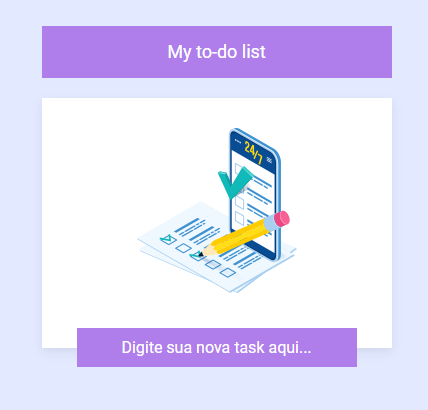

<h1 align="center">Projeto - Angular : To-do list</h1>

<p align="center">
  

  

  
  
  <a href="https://github.com/JeanGomes01/Github-Blog/commits/master">
    
  </a>
    
   <a href="https://github.com/JeanGomes01/to-do-list-angular/stargazers">
    
  </a>
</p>

<p align="center">Vamos construir uma to-do list em Angular, utilizando localStorage para persistência das tarefas. </p>

<p align="center">

</p>

## 🥶 Sobre o projeto

Desenvolvi esse projeto para reforçar meu conhecimento em Angular e Tyopescript principalmente com CRUD armazenando informações no Local Storage do browser.

## 🚀 Tecnologias

Principais tecnologias que utilizei para desenvolver esta aplicação

- [Typescript](https://www.typescriptlang.org/)
- [Angular](https://angular.dev/overview)

## Guia de inicialização

Para instalar e configurar uma cópia local, siga estas etapas simples:

### Pré-requisitos

Para garantir o funcionamento adequado da nossa aplicação, verifique abaixo:

1. **Clone o repositório de terceiros que contém a api pronta para poder testar o app**: Neste link: [TO-DO LIST-ANGULAR](https://github.com/JeanGomes01/to-do-list-angular)

2. **Clone o repositório**:

```sh
git clone https://github.com/JeanGomes01/to-do-list-angular
```

3. **Navegue na raiz do projeto to-do-list-angular:**

4. **Instale os módulos:**

```sh
npm i
```

5. **Rode o aplicativo:**

```sh
ng serve
```

## Roadmap

- [x] Iniciar a aplicação Web

- [x] Conseguir criar tarefas.

- [x] Conseguir editar tarefas

- [x] Conseguir deletar ou excluir tarefas.

- [x] Conseguir deletar todas as tarefas de uma única vez.

- [x] Manter armazenado as tarefas no Storage Local.

<!-- --------------------- -->

## UI UX

UI e UX feita pelo time de design do treinamento do curso.

|             Tela de inicial             |               Tela de tarefas                |
| :-------------------------------------: | :------------------------------------------: |
|  |  |
